# 技术管理手册摘录

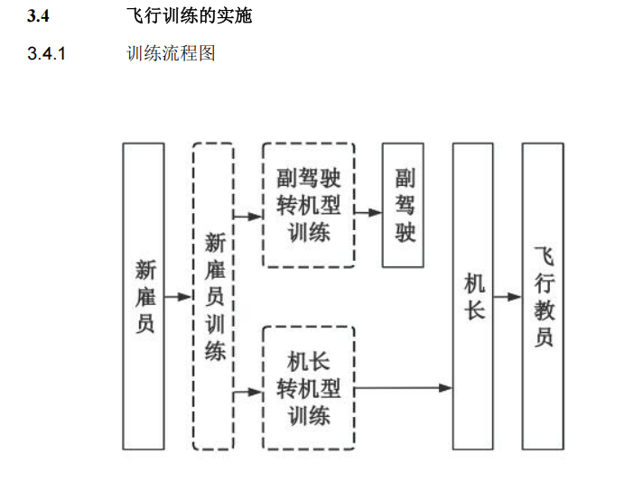

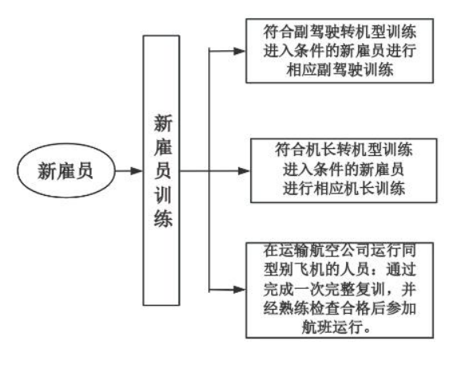

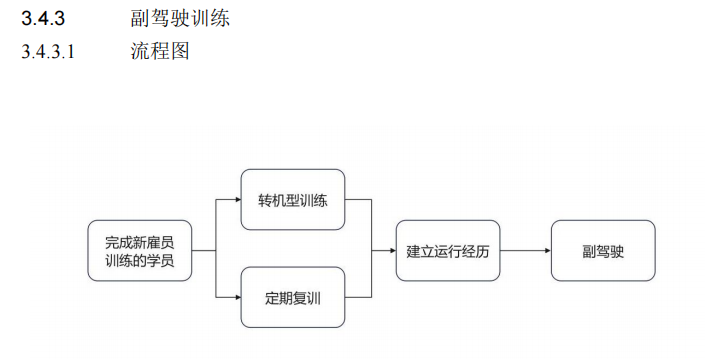

## A1副驾驶之前

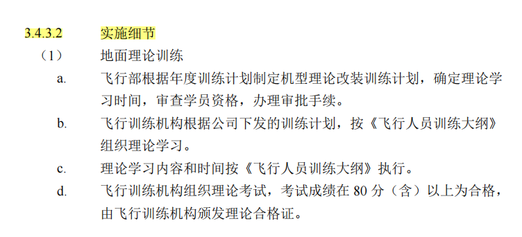

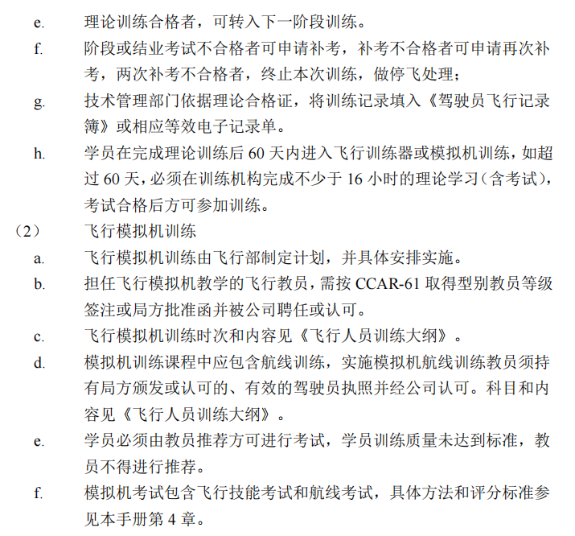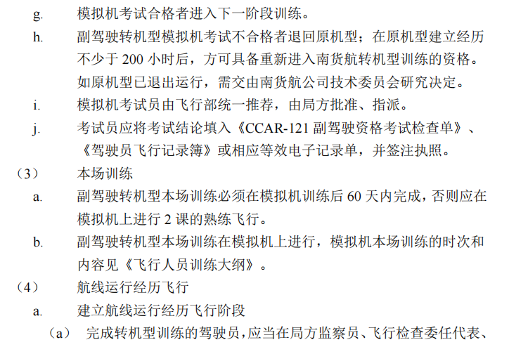

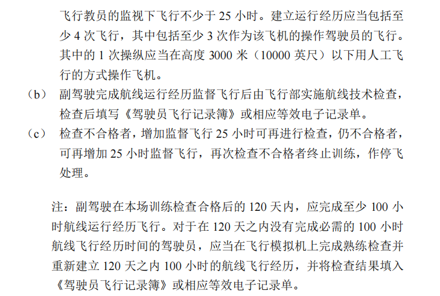

## 副驾驶升级条件

飞行经历+一体化+航线检查通过

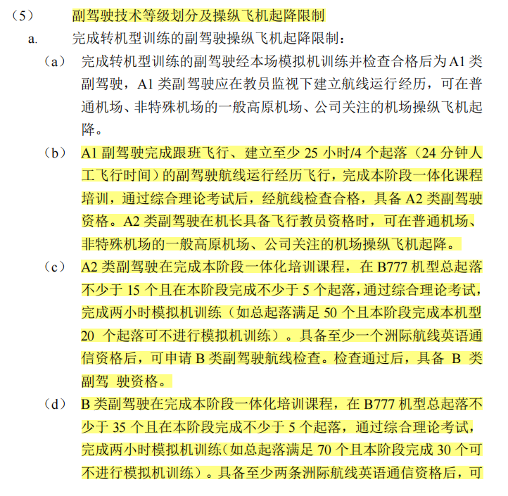

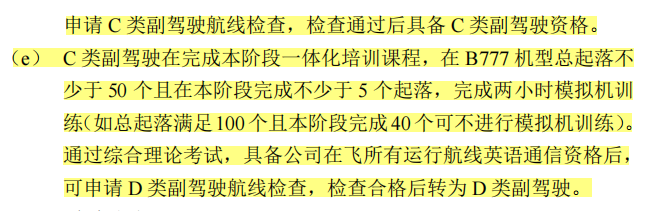

## 机长之前

机长转机型：机长转机型理论训练+模拟机训练+本场模拟机+建立飞行经历

聘用前：完成转机型训练的驾驶员应在左座建立25小时/4个起落后实施航线飞行技术检查

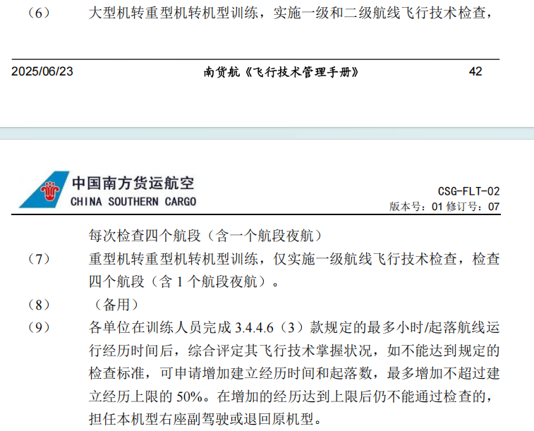

## 机长技术等级划分及运行限制

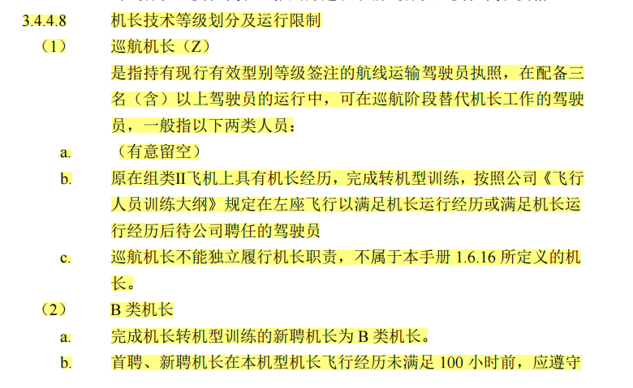

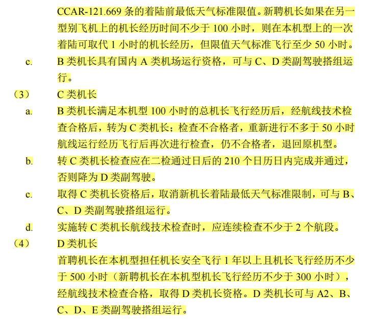

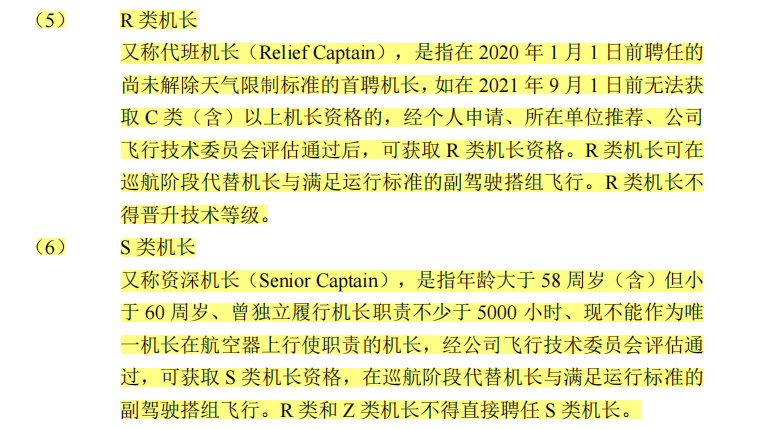

## 飞行教员训练

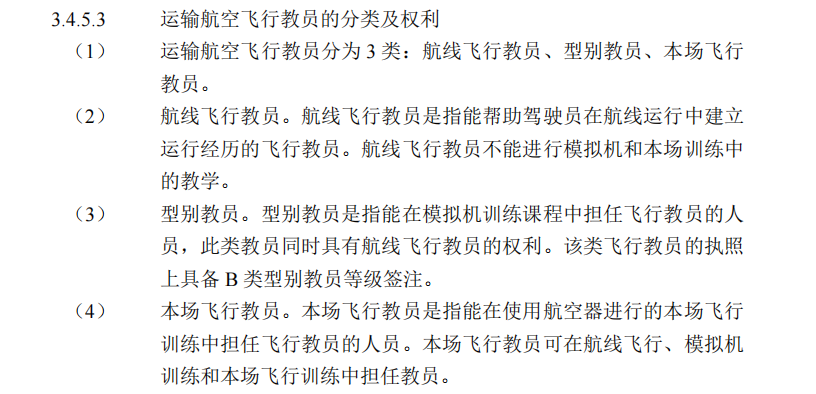

飞行教员等级/资格的更新

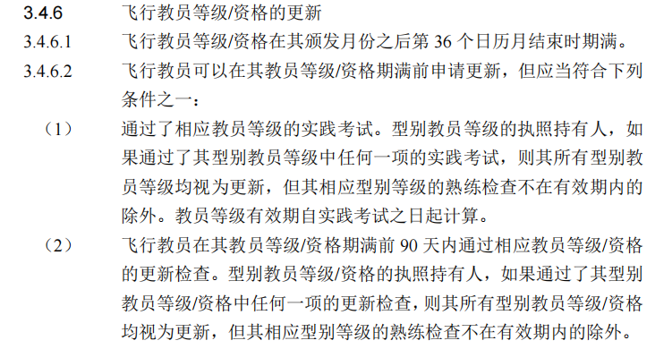

## 英语

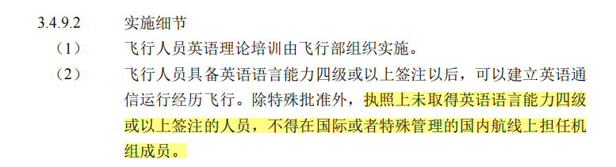

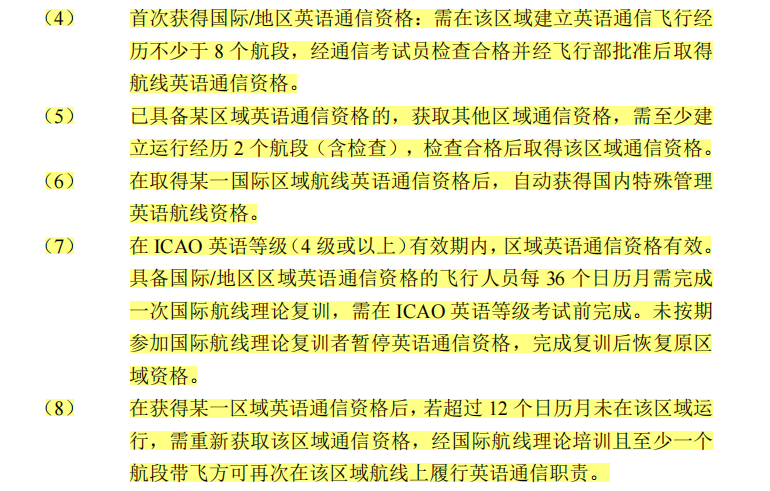

## 应急

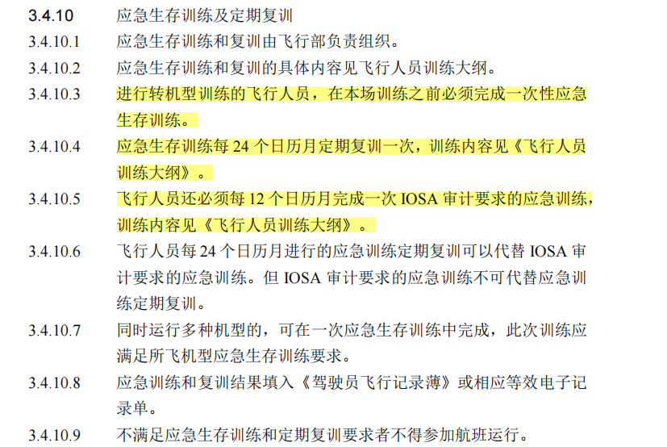

## CRM

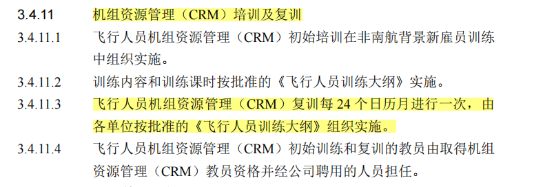

## 3.4.13 定期复训和熟练检查

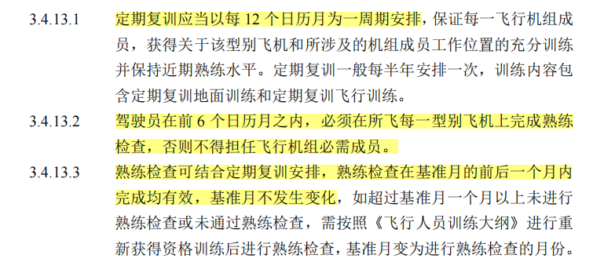

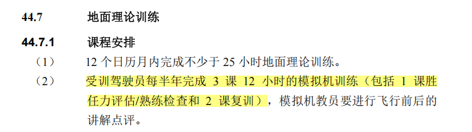

3.4.13.11 熟练检查不合格后的处理

3.4.14 恢复资格训练

## 笔记区

### 必须有的资格

近期经历有效：90天3起落，120天100小时

熟练检查/复训在有效期内

各类如安保/危险品资质在有效期内

### 飞行经历

飞行经历包括在座时间和起落数，是升级的评估条件