# 训练大纲

## 新雇员训练

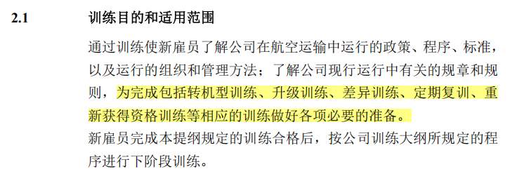

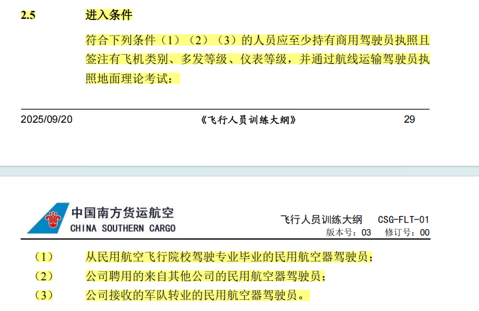

注：相同机型完成新雇员后，不需要转机型

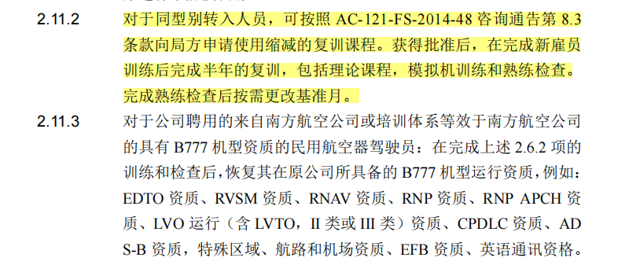

## 副驾驶转机型

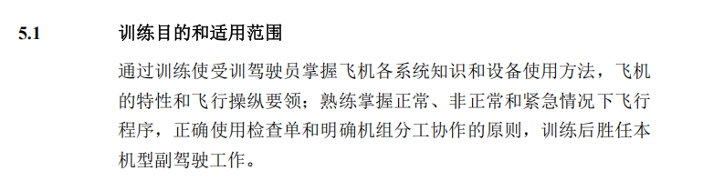

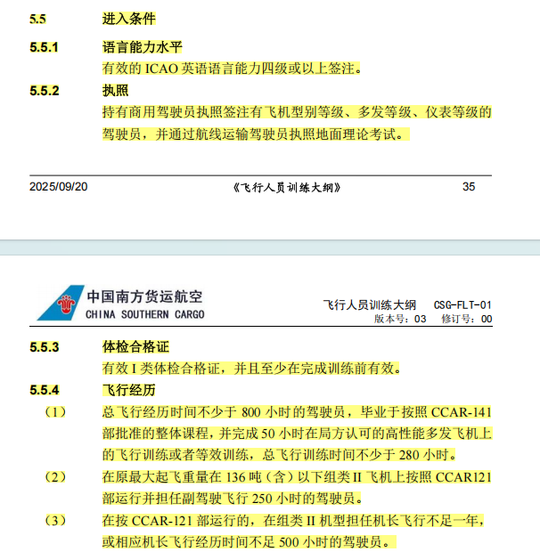

理论+模拟机+本场模拟机后，建立飞行经历

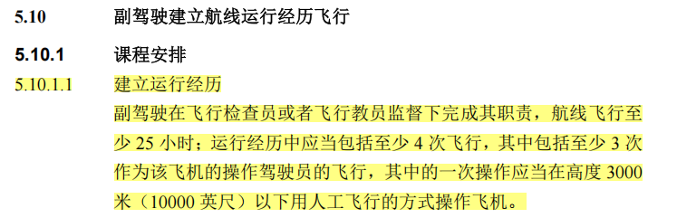

## 机长转机型训练提纲

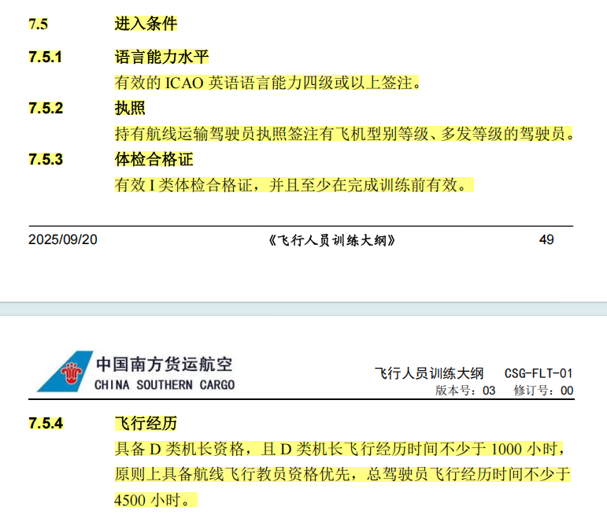

理论+模拟机+本场模拟机后，建立飞行经历

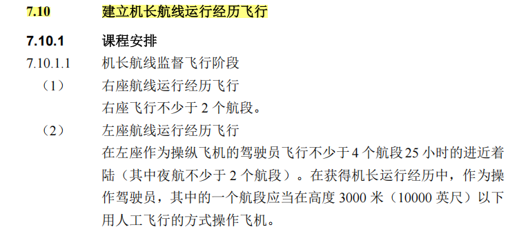

## 航线飞行教员训练提纲

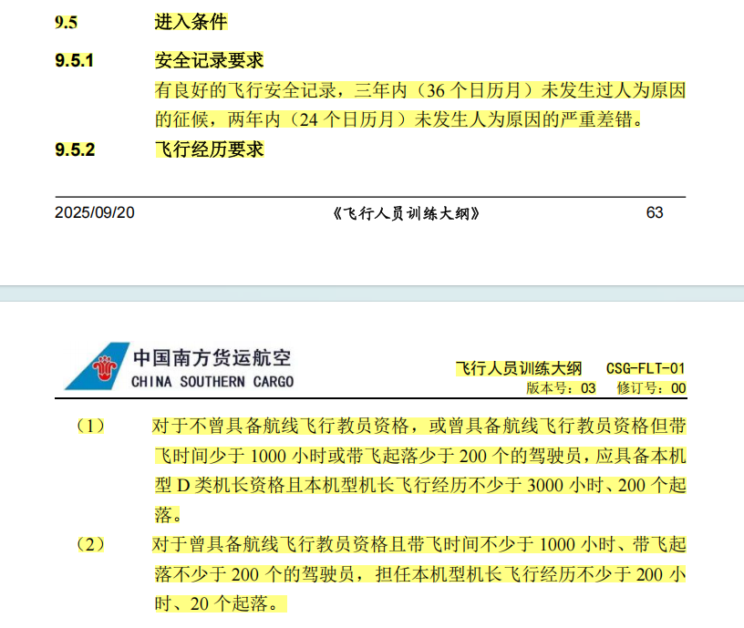

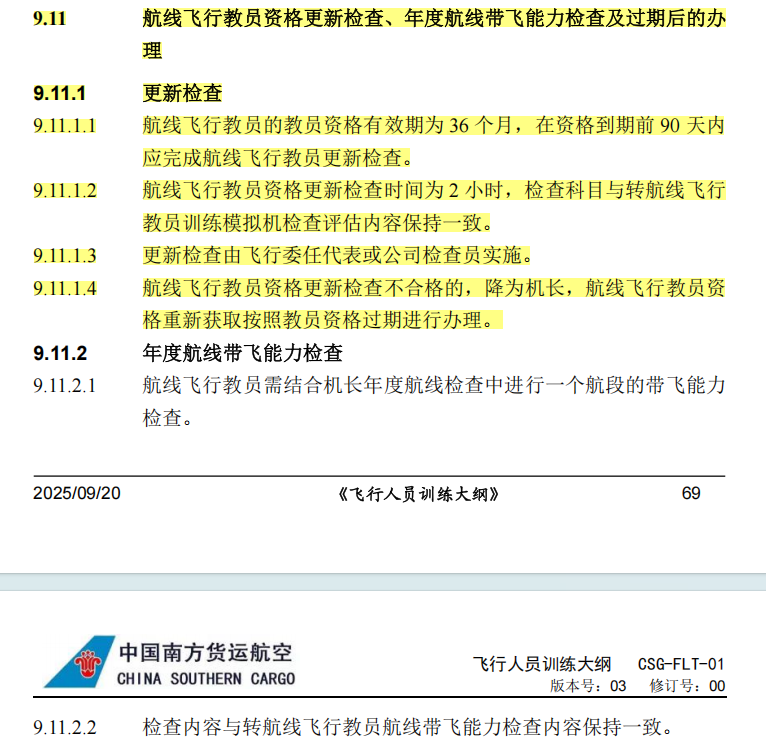

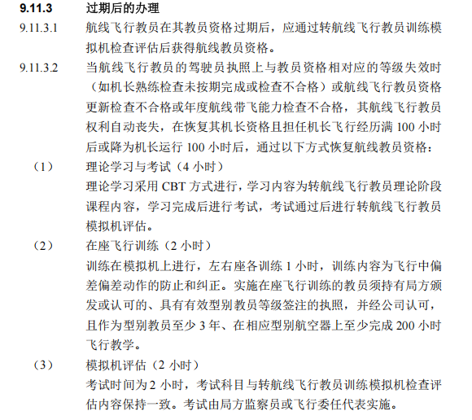

## 型别教员训练提纲

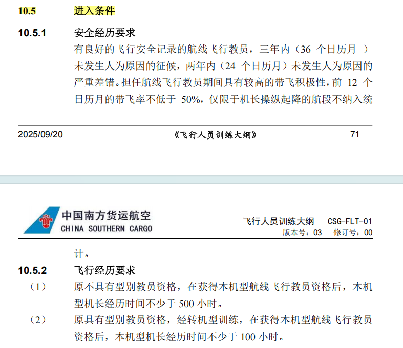

资格保持：查阅手册

## 飞行检查员训练提纲

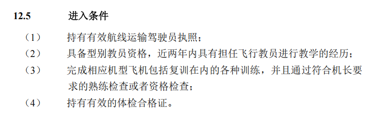

## 重新获得资格训练提纲

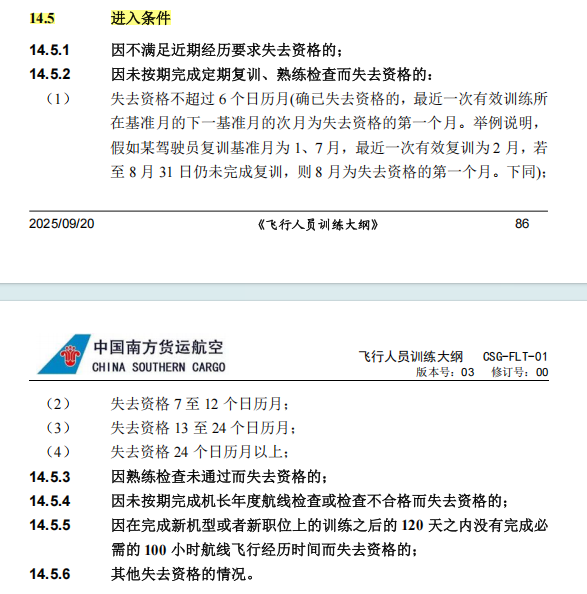

14.6 课程安排
14.6.2 因未按期完成定期复训、熟练检查而失去资格的
14.6.3 因熟练检查未通过而失去资格

## 应急生存训练提纲

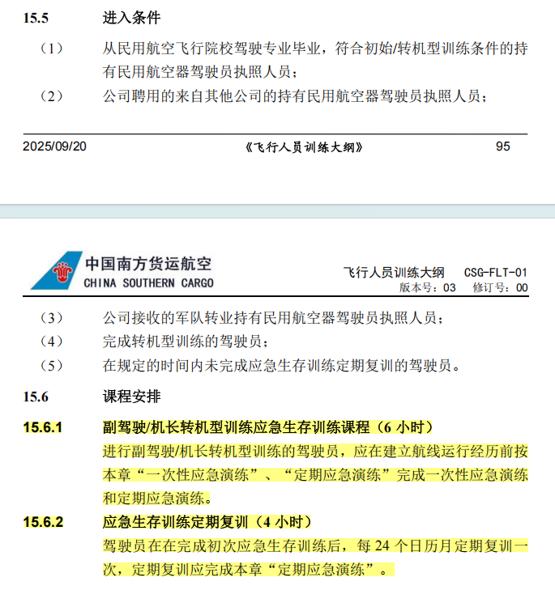

## 通信英语训练提纲

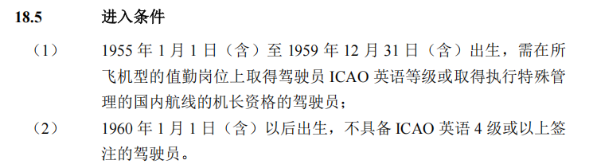

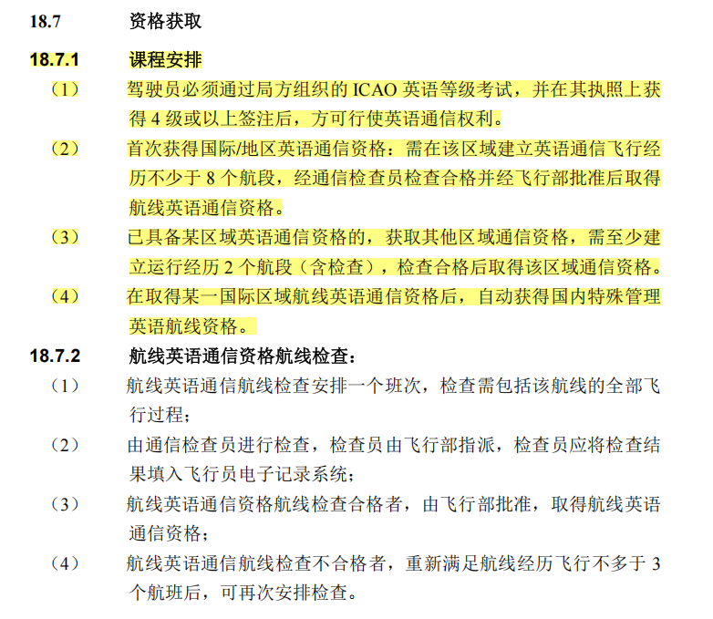

## I 类 ILS 自动着陆训练提纲

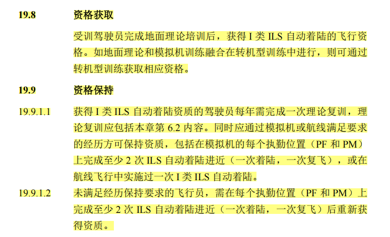

## LVO 训练提纲

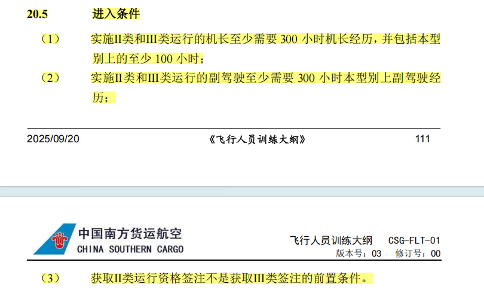

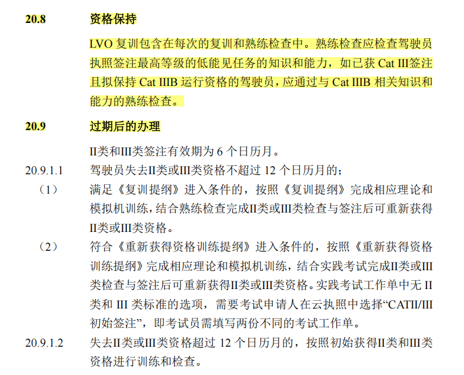

## CRM 训练提纲

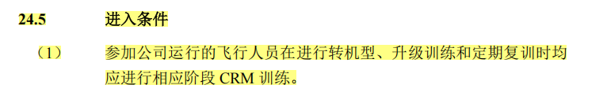

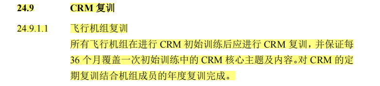

## 疲劳管理训练提纲

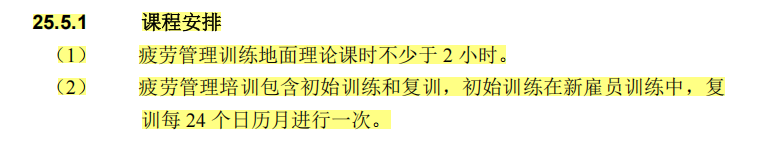

## 初阶 EBT 训练提纲

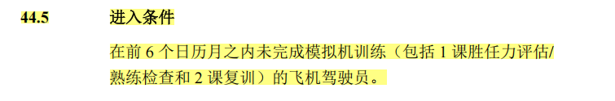

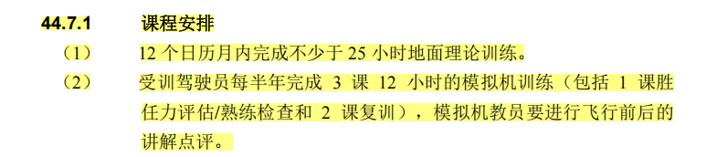

## 安保培训提纲

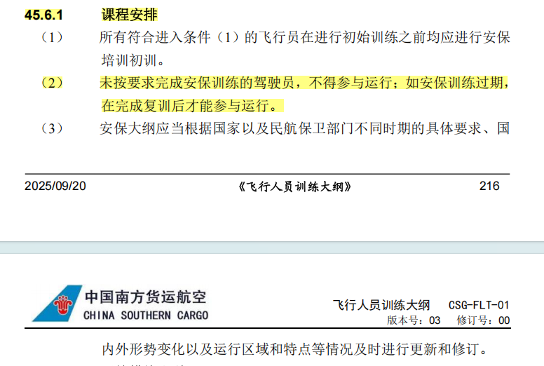

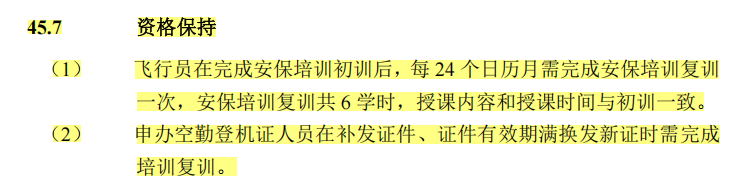
