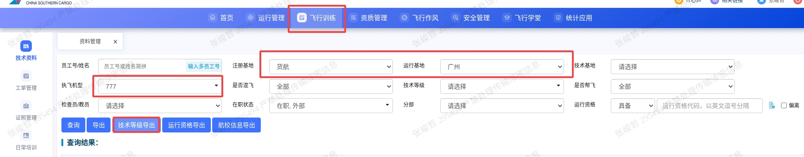
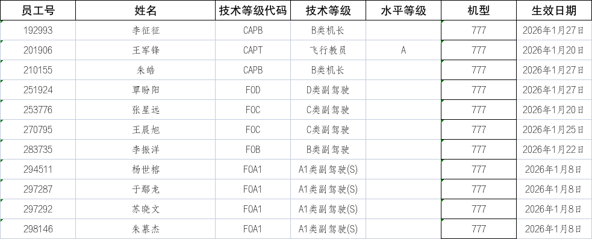
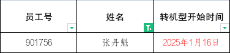

技术等级指的是比如A1、A2、B、C、D、ABC教等副驾驶/机长/教员的技术级别，每月需要给人力通报

导出技术资格

人力系统中仅区分副驾驶（ABCD）、机长、教员，所以需要关注的技术等级变更为：
副驾驶：FOA1，FOB，FOC，FOD
机长：CAPB
教员：CAPTA

需要关注：

令：Z类机长有1年保护期即从转机型开始1年期间享受改装待遇，1年后取消改装待遇，需要关注去年当月的转机型机长，取消改装待遇。
如：在2026年1月需要关注：

