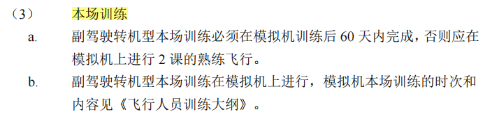
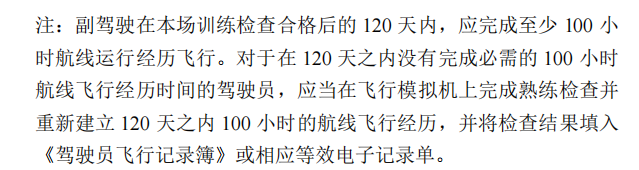
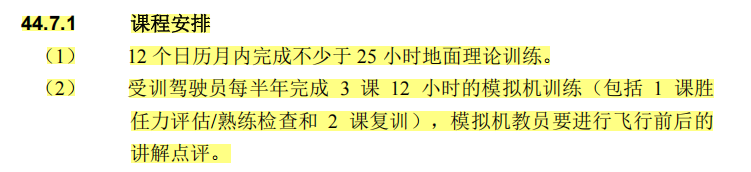
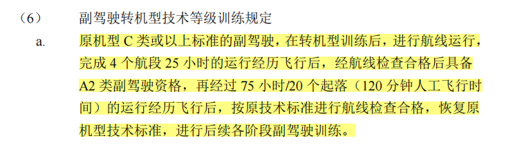

# 副驾驶
## 本场训练

分为真飞机本场和模拟机本场，需要用真飞机做本场的情景有：
初始训练（副驾驶，进公司后第一次获取公司运行机型资格的训练，真飞机）
副驾驶升机长（真飞机，货航无这种类型）

## 120天100小时要求

**首先复训基准月由熟练检查决定。**

**首次基准月由实践考试所在月份决定**

无法满足120天100小时的策略：
方案1：假设1月过期，2月是基准月，则排1月复训（包括一课的熟练检查）
方案2：见下图，无法通过调整基准月去覆盖，则单独排1课熟练检查（基准月变更），然后下次进行一次完整复训（包括2课复训+1课熟练检查），基准月回归原始周期。

## 副驾驶航线检查
A2、B：作为 PF，1个航段
C、D：作为 PF、PM，2个航段

## 副驾驶转机型（为什么C类副驾驶后才进行流转）

