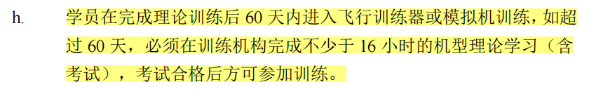
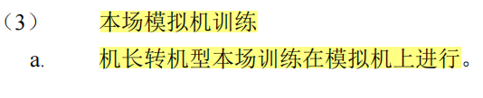
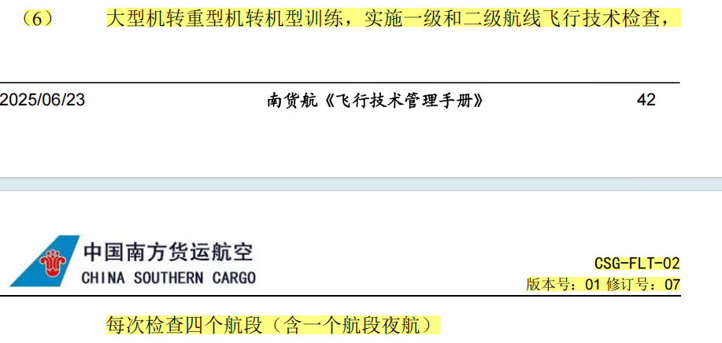
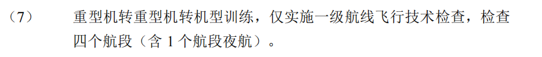
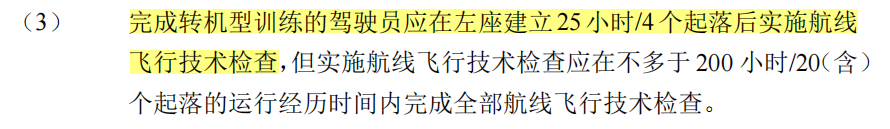
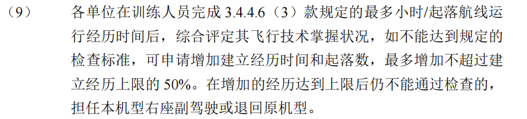
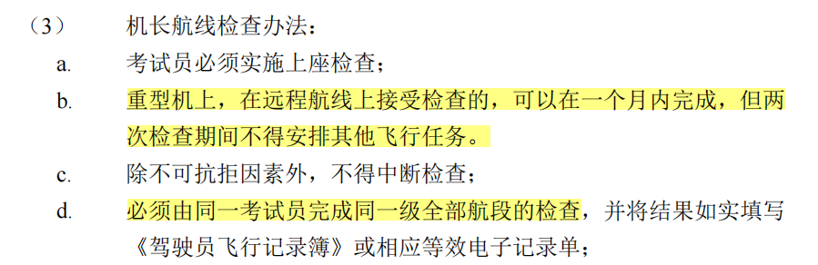
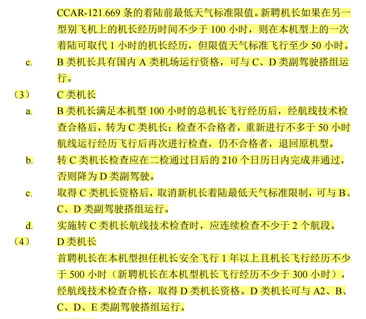

## 60天的时间要求

关于60天的时间要求，是来自局方的要求。通用格式是在完成XXX后的60天内，需要进入XXX训练，否则需要退回/补充XXX训练。比如：

有时公司手册会沿用局方的惯例设置60天的条件。

## 一检二检

重转重只需要一检

一检二检阶段在转机型之后，此阶段不能多于300小时

一检二检实施

机长分级

注意：实施转 C 类机长航线技术检查时，应连续检查不少于 2 个航段。C类机长是一个关键节点。
